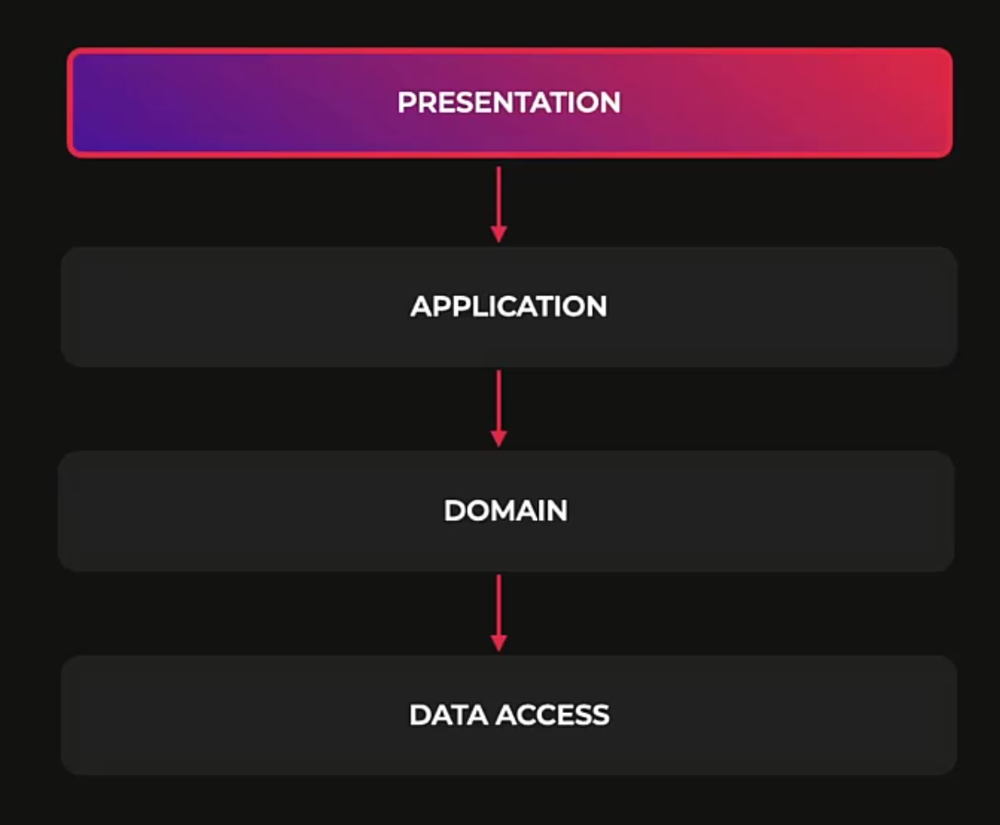
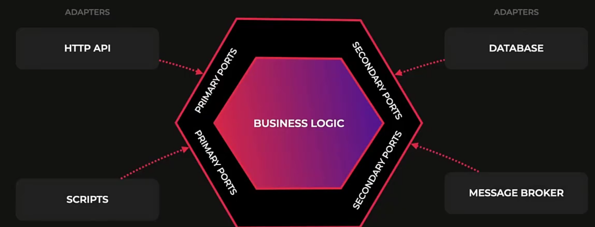
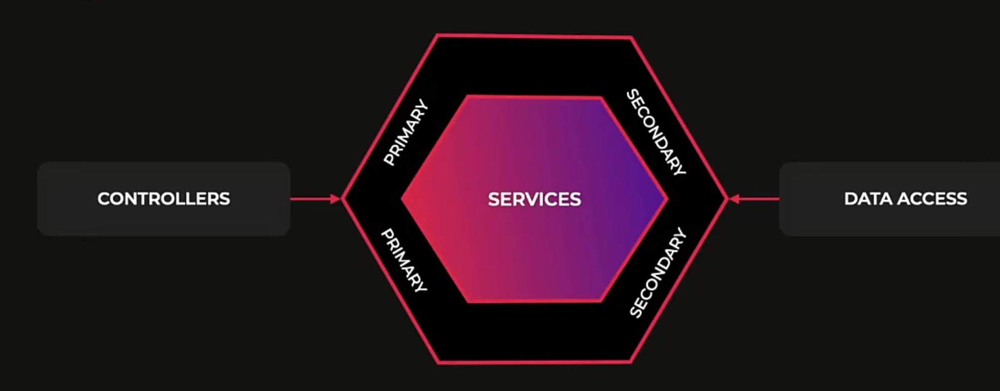
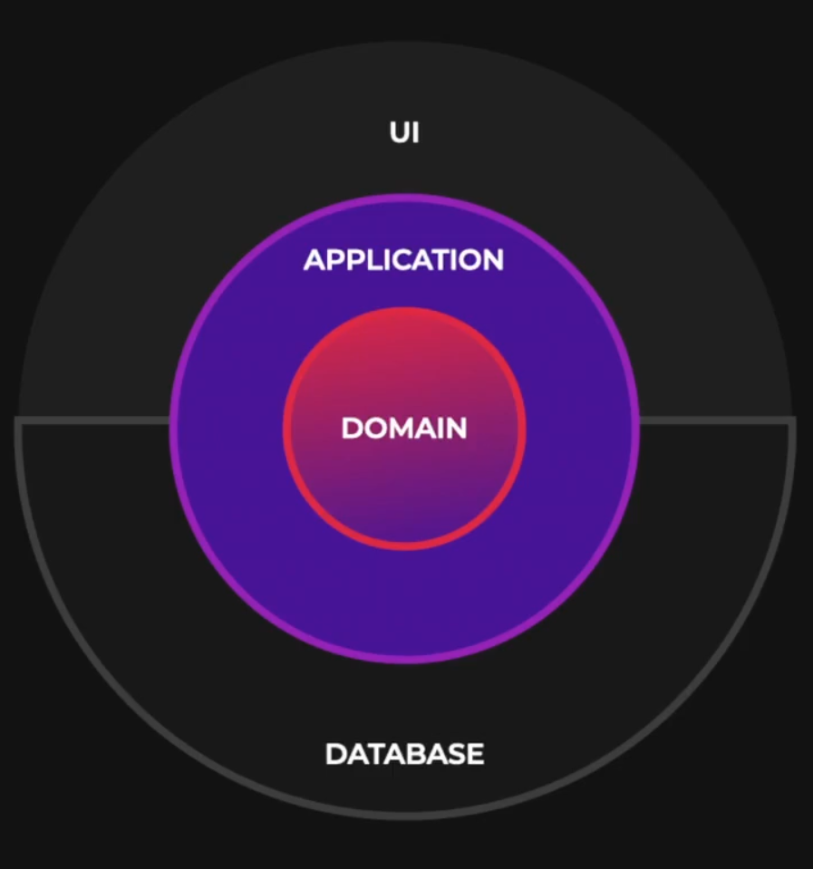
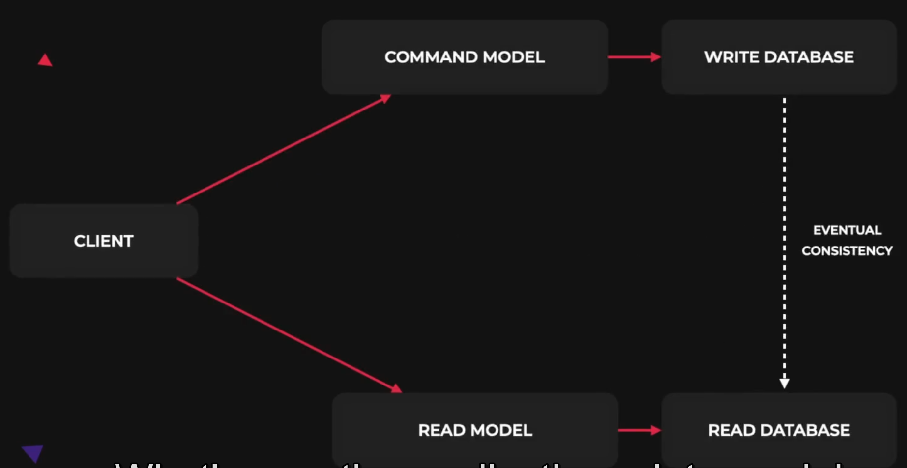

<p align="center">
  <a href="http://nestjs.com/" target="blank"></a>
</p>

[circleci-image]: https://img.shields.io/circleci/build/github/nestjs/nest/master?token=abc123def456
[circleci-url]: https://circleci.com/gh/nestjs/nest

  <p align="center">A progressive <a href="http://nodejs.org" target="_blank">Node.js</a> framework for building efficient and scalable server-side applications.</p>
    <p align="center">
<a href="https://www.npmjs.com/~nestjscore" target="_blank"></a>
<a href="https://www.npmjs.com/~nestjscore" target="_blank"></a>
<a href="https://www.npmjs.com/~nestjscore" target="_blank"></a>
<a href="https://circleci.com/gh/nestjs/nest" target="_blank"></a>
<a href="https://coveralls.io/github/nestjs/nest?branch=master" target="_blank"></a>
<a href="https://discord.gg/G7Qnnhy" target="_blank"></a>
<a href="https://opencollective.com/nest#backer" target="_blank"></a>
<a href="https://opencollective.com/nest#sponsor" target="_blank"></a>
  <a href="https://paypal.me/kamilmysliwiec" target="_blank"></a>
    <a href="https://opencollective.com/nest#sponsor"  target="_blank"></a>
  <a href="https://twitter.com/nestframework" target="_blank"></a>
</p>
  <!--[](https://opencollective.com/nest#backer)
  [](https://opencollective.com/nest#sponsor)-->

## Description

[Nest](https://github.com/nestjs/nest) framework TypeScript starter repository.

## Installation

```bash
$ npm install
```

## Running the app

```bash
# development
$ npm run start

# watch mode
$ npm run start:dev

# production mode
$ npm run start:prod
```

## Test

```bash
# unit tests
$ npm run test

# e2e tests
$ npm run test:e2e

# test coverage
$ npm run test:cov
```

## Support

Nest is an MIT-licensed open source project. It can grow thanks to the sponsors and support by the amazing backers. If you'd like to join them, please [read more here](https://docs.nestjs.com/support).

## Stay in touch

- Author - [Kamil Myśliwiec](https://kamilmysliwiec.com)
- Website - [https://nestjs.com](https://nestjs.com/)
- Twitter - [@nestframework](https://twitter.com/nestframework)

## License

Nest is [MIT licensed](LICENSE).

## A layered (N-tier) architecture



## Hexagonal architecture - ports and adapters architecture

That arms to create a highly decoupled and testable application by emphasizing the separation of concerns between core business and external concerns such as database, user interface and framework

The key Concept: the use of ports in adapter

Ports are interfaces that represent the entry points into the core. They Define the contract for interactions with the external world and represent the applications use cases and bound. Allowing external concerns to interact with the application

Adapters implement the interfaces or parts defined by the core domain. They serve as the bridge between the core application and the external concern. Adapters are responsible for translating the language of the core domain into something that external systems can Such as data persistence mechanisms apis or user interface.

 The architecture revolves around the idea of dependency inverse. Which means that high level modules should not depend on low-level modules such as those external concerns. Instead both should depend on abstractions known as port. This inversion of dependencies enables the core to remain independent and isolated from external systems

Benefit: 
- loose coupling between the core domain and external. Allowing changes to a current in one area without affecting others
- Testability: it becomes easier to test the core domain and isolation Without relying on external system
- Flexibility: allows for the replacement Or modification of external concerns or adapters
- Isolation of core domain: 
- Domain Centric design: Encourages a strong focus on the core domain and The Business

Note that instead of using abstract classes we could use interfaces here but the reason we chose to use abstract classes. that they serve as injection tokens in nestjs. With interface, purely typescript constructs and are wiped out during the transportation process. this means that they would not be available at run time making classes a much better choice for us to use







summarize: Hexagonal architecture focuses on a strong separation of concerns, dependency inversion, And clear interfaces known as ports

## Onion architecture



## Domain-driven design

Domain driven design tackling complexity in the heart of software. The structure in language of our code should match that of the business domain

DDD is about creating a language that connects the implementation to the business experts and their knowledge

Strategy design: 
- Domain story telling
- Event storming
- Contact mapping

=> identify the core domain and sub domain, answer the bound context and context map in our system

Building block:
- Entity: 
- Value object
- Aggregates
- Repository
- Service: encapsulate domain logic that doesn't belong to any particular entity or value object
- Factories: creation of objects involves complex validation, initialization
- Event: used to communicate and capture domain specific information about actions or domain model change that have happened in the past; crucial rule in enabling loose coupling scalability, eventual consistency and distributed. 2 type of event: domain event and integration

## Command query responsibility segregation
 
software architectural pattern that separates the concerns of reading data (query) and writing data commands into separate models

The core idea behind cqrs is to have different models and approaches for handling read And write operations in Rather than combining them into a single model

In traditional architectures and Credit Systems, The same model is often used to handle both read and write operations


However as applications grow in complexity, Requirements for reading and writing data can diverge significantly. This can lead to issues related to Performance scalability and maintainability

What's cqrs the applications data model is divided into two separate parts



The command model: This model enforces business rules and validation logic to ensure that data changes are correct and consistent

the query model: optimized for reading data And often involves denormalized data structures or specialized views that cater to specific read use

This separation allows for efficient querying and improves the overall performance of the read operation

The cqrs approach offers several benefits: 

- Perform: It allows us to optimize the read and write operations independently. This allows us to choose the right tool for the job >And optimize the data source for their specific use cases
- Scalability: allow scale the read and write operations . For example an excuse case is a flight booking system. Where the read operations are much much more frequent
- Maintainability:  allows us to evolve the read and write models independently as well

drawbacks: 

- Complexity: an additional complexity to a system making it harder to understand and not Suited for simple application
- eventual consistency: 

CQRS is also used in combination with event sourcing and event-driven architecture.

## Event-driven architecture

Event define as a significant change in state such as user action, data update, messages from external service

Three main component: 
- Event producers: publish events to the event bus, act as source of event
- Event consumers: subscribe to event from the event bus, act as sink of event
- Event bus: a communiation chanel that connect event producers and event consumers, act as a message broker

Benefit:
- Loose coupling between component since consumers don't need to know about the producers and versa
- Scalability: we can add more consumer to increase the throughput and processing capability
- Async processing: 

Drawback
- Overall complexity: maintain this system can be challenging 
- Data consistency complexity
- Transaction integrity: multiple services

## Eventual consistency

CAP theorem describe the trade-off that arise when designing distributed systems 

## Even sourcing

Event sourcing is an architectural pattern utilized in software development and distributed systems. Were the state of an application is determined by a sequence of events Rather than storing the current As a single record in a database.

An event sourcing, each change in the application state is captured as an immutable event. These events represent meaningful action or fact that have occurred within the system. instead of updating the state directly, new event are appended to an event store in chronological order. This is fundamentally different from the traditional approach. the current state of stored in a database and updated whenever a change occurs.

Some key characteristics of event sourcing are:

- Immutable events: Events cannot be altered or deleted once stored. >Ensuring an auditable record of all changes made to the application State over time

- Event store: Events are stored in an event store, an appendix log of event. >The event store is the single source of Truth for the application state

- state reconstruction: The application State can be reconstructed by replaying all the events from the event store. This allows for a comprehensive historical view of the application State and supports features like time travel debugging, Logging and audit

Some benefits of event sourcing are:

- Auditability:  provides a complete history of all changes made to the application State over time. This allows us to easily audit the system and understand how the state is evolved

- Time travel debugging: the ability to replay events and enables developers to time travel

- debug the application: 

- Scalability: Event sourcing allows us to scale the read and write side of the application independently

Drawback:

- being complex: Event sourcing is a complex pattern that requires a lot of boilerplate code to implement. This can make the project difficult to understand and maintain

- Eventual consistency: The read side of the application is eventually consistent with the write side